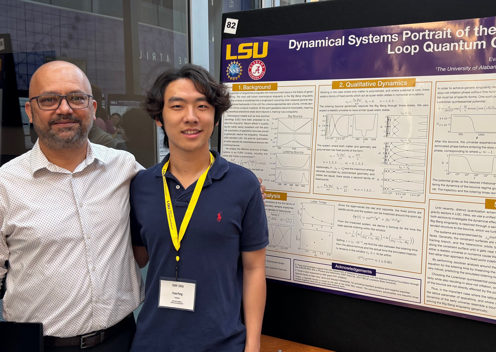
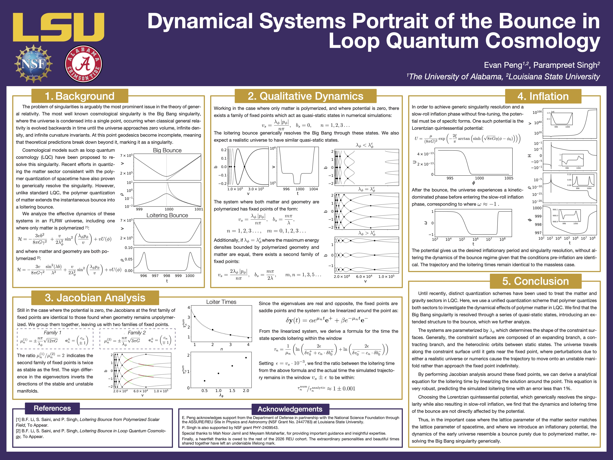
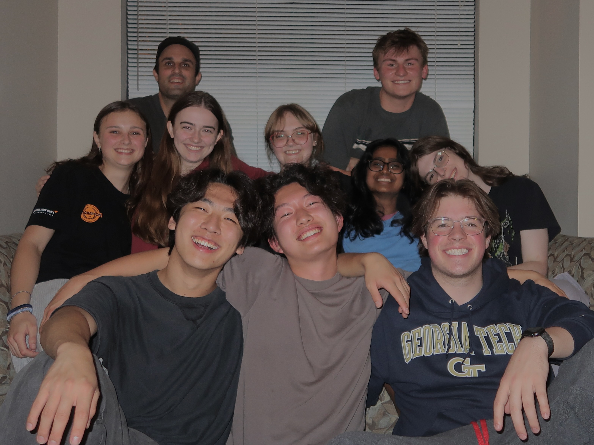

---

::: {.wrap-container}
{.wrap-image} 

### Dynamical Systems Portrait of the Bounce in Loop Quantum Cosmology

**LSU Physics and Astronomy REU:** Summer 2026\
**Advisor: Dr. Parampreet Singh**

:::

In this research project, I worked with Dr. Parampreet Singh on a new cosmological model based on Loop Quantum Cosmology (LQC). In this new model, there exist new "loitering states" which replaces the standard Big bounce in LQC. My project was on performing a Jacobian analysis around the fixed points that make up these "loitering states". 

I developed background in standard LQC, where I leared the ADM formalism for general relativity, the WDW cannonical quantization of gravity, Ashtekar variables, the holonomy-flux algebra, and polymer quantization. 

Then I worked with the classical effective Hamiltonian which approximates this new cosmological model, deriving the equations of motion and performing the Jacobian analysis on the fixed points. I focused on the stability of the fixed points, during which, we derived a novel equation describing the "loitering time" of the universe around each fixed point. 

I then developed the simulator using SciPy to numerically evolve the system using the classical effective Hamiltonian. Our analytical results were then verified based on the numerical evolution. I presented these results at the Summer Undergradaute Research Fourm at LSU, and I am now currently working on the manuscript to be published.

:::: {.columns}

::: {.column width="48.5%"}
<!--  -->
:::

::: {.column width="3.5%"}
<!-- Empty column to create a gap between the text and image -->
:::

::: {.column width="48%"}

:::

::::

---

:::: {.columns}

::: {.column width="58%"}
### SingAura: AI Voice Coach

**University of Alabama:** Fall 2024-Present\
**Advisor: Dr. Yi Lin**

:::

::: {.column width="3%"}
<!-- Empty column to create a gap between the text and image -->
:::

::: {.column width="39%"}

:::

::::